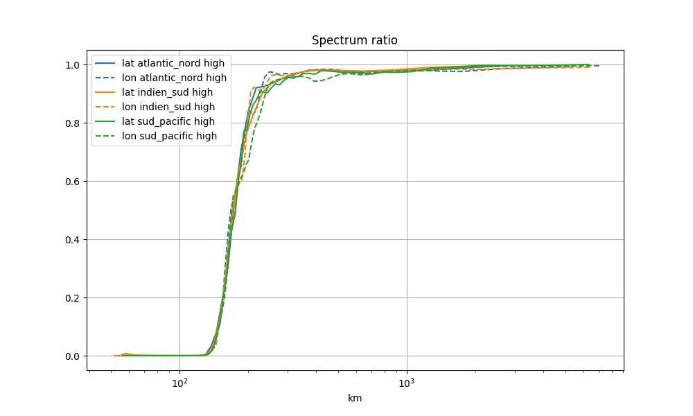

# README #

### How do I get set up? ###

To avoid problems with installation, use of the virtualenv Python virtual environment is recommended.

Then use pip to install all dependencies (numpy, scipy, matplotlib, netCDF4, cython, pyproj, Shapely, ...), e.g.:

```bash
pip install cython numpy matplotlib scipy netCDF4 shapely pyproj
```

Then run the following to install the eddy tracker:

```bash
python setup.py install
```

Two executables are now available in your PATH: EddyIdentification and EddyTracking

Edit the corresponding yaml files and then run the code, e.g.:

```bash
EddyIdentification eddy_identification.yaml
```

for identification, followed by:

```bash
EddyTracking tracking.yaml
```

for tracking.


# Py Eddy Tracker module #

### Grid manipulation ###

Loading grid
```python
from py_eddy_tracker.dataset.grid import RegularGridDataset
h = RegularGridDataset('share/nrt_global_allsat_phy_l4_20190223_20190226.nc', 'longitude', 'latitude')
```

Plotting grid
```python
from matplotlib import pyplot as plt
fig = plt.figure(figsize=(14, 12))
ax = fig.add_axes([.02, .51, .9, .45])
ax.set_title('ADT (m)')
ax.set_ylim(-75, 75)
ax.set_aspect('equal')
m=ax.pcolormesh(h.x_bounds, h.y_bounds, h.grid('adt').T.copy(), vmin=-1, vmax=1, cmap='coolwarm')
ax.grid(True)
plt.colorbar(m, cax=fig.add_axes([.94, .51, .01, .45]))
```

Filtering
```python
h.bessel_high_filter('adt', 500, order=3)
```

Add second plot
```python
ax = fig.add_axes([.03, .02, .9, .45])
ax.set_title('ADT Filtered (m)')
ax.set_aspect('equal')
ax.set_ylim(-75, 75)
m=ax.pcolormesh(h.x_bounds, h.y_bounds, h.grid('adt').T, vmin=-.1, vmax=.1, cmap='coolwarm')
ax.grid(True)
plt.colorbar(m, cax=fig.add_axes([.94, .02, .01, .45]))
fig.savefig('share/png/filter.png')
```


#### Compute spectrum and spectrum ratio on some area ####
Load data
```python
grid_name, lon_name, lat_name = 'share/nrt_global_allsat_phy_l4_20190223_20190226.nc', 'longitude', 'latitude'
raw = RegularGridDataset(grid_name, lon_name, lat_name)
filtered = RegularGridDataset(grid_name, lon_name, lat_name)
filtered.bessel_low_filter('adt', 150, order=3)

areas = dict(
    sud_pacific=dict(llcrnrlon=188, urcrnrlon=280, llcrnrlat=-64, urcrnrlat=-7),
    atlantic_nord=dict(llcrnrlon=290, urcrnrlon=340, llcrnrlat=19.5, urcrnrlat=43),
    indien_sud=dict(llcrnrlon=35, urcrnrlon=110, llcrnrlat=-49, urcrnrlat=-26),
    )
```

Compute and display spectrum
```python
fig = plt.figure(figsize=(10,6))
ax = fig.add_subplot(111)
ax.set_title('Spectrum')
ax.set_xlabel('km')
for name_area, area in areas.items():

    lon_spec, lat_spec = raw.spectrum_lonlat('adt', area=area)
    mappable = ax.loglog(*lat_spec, label='lat %s raw' % name_area)[0]
    ax.loglog(*lon_spec, label='lon %s raw' % name_area, color=mappable.get_color(), linestyle='--')

    lon_spec, lat_spec = filtered.spectrum_lonlat('adt', area=area)
    mappable = plt.loglog(*lat_spec, label='lat %s high' % name_area)[0]
    plt.loglog(*lon_spec, label='lon %s high' % name_area, color=mappable.get_color(), linestyle='--')

ax.set_xscale('log')
ax.legend()
ax.grid()
fig.savefig('share/png/spectrum.png')
```


Compute and display spectrum ratio
```python
fig = plt.figure(figsize=(10,6))
ax = fig.add_subplot(111)
ax.set_title('Spectrum ratio')
ax.set_xlabel('km')
for name_area, area in areas.items():
    lon_spec, lat_spec = filtered.spectrum_lonlat('adt', area=area, ref=raw)
    mappable = ax.plot(*lat_spec, label='lat %s high' % name_area)[0]
    ax.plot(*lon_spec, label='lon %s high' % name_area, color=mappable.get_color(), linestyle='--')

ax.set_xscale('log')
ax.legend()
ax.grid()
fig.savefig('share/png/spectrum_ratio.png')
```
