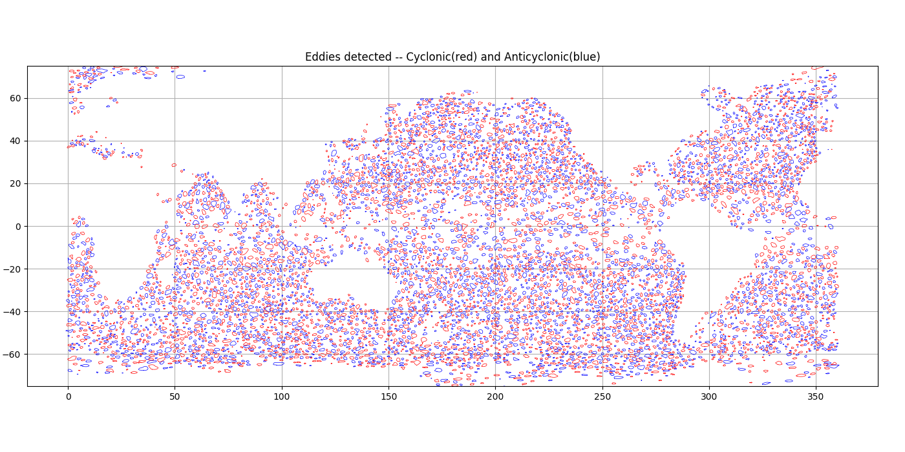

=====================
Eddies identification
=====================

Run an identification on a grid
*******************************

Activate verbose

.. code-block:: python

    import logging
    logging.getLogger().setLevel('DEBUG') # Values: ERROR, WARNING, INFO, DEBUG

Run identification

.. code-block:: python

    from datetime import datetime
    h = RegularGridDataset(grid_name, lon_name, lat_name)
    h.bessel_high_filter('adt', 500, order=3)
    date = datetime(2019, 2, 23)
    a, c = h.eddy_identification(
        'adt', 'ugos', 'vgos', # Variable to use for identification
        date, # Date of identification
        0.002, # step between two isolines of detection (m)
        pixel_limit=(5, 2000), # Min and max of pixel can be include in contour
        shape_error=55, # Error maximal of circle fitting over contour to be accepted
        )

Plot identification

.. code-block:: python

    fig = plt.figure(figsize=(15,7))
    ax = fig.add_axes([.03,.03,.94,.94])
    ax.set_title('Eddies detected -- Cyclonic(red) and Anticyclonic(blue)')
    ax.set_ylim(-75,75)
    ax.set_xlim(0,360)
    ax.set_aspect('equal')
    a.display(ax, color='b', linewidth=.5)
    c.display(ax, color='r', linewidth=.5)
    ax.grid()
    fig.savefig('share/png/eddies.png')

Save identification datas

.. code-block:: python

    with Dataset(date.strftime('share/Anticyclonic_%Y%m%d.nc'), 'w') as h:
        a.to_netcdf(h)
    with Dataset(date.strftime('share/Cyclonic_%Y%m%d.nc'), 'w') as h:
        c.to_netcdf(h)
