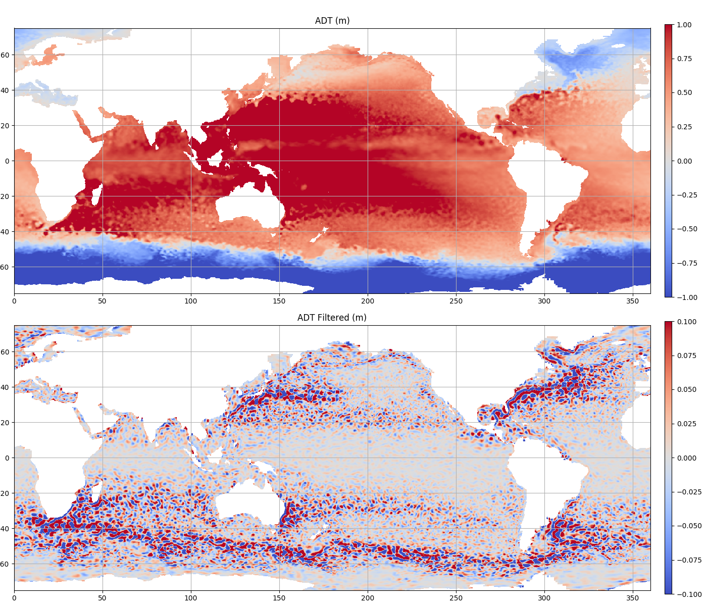

===========================
Load, Display and Filtering
===========================

Loading grid

.. code-block:: python

    from py_eddy_tracker.dataset.grid import RegularGridDataset

    grid_name, lon_name, lat_name = (
        "share/nrt_global_allsat_phy_l4_20190223_20190226.nc",
        "longitude",
        "latitude",
    )
    h = RegularGridDataset(grid_name, lon_name, lat_name)

Plotting grid

.. code-block:: python

    from matplotlib import pyplot as plt

    fig = plt.figure(figsize=(14, 12))
    ax = fig.add_axes([0.02, 0.51, 0.9, 0.45])
    ax.set_title("ADT (m)")
    ax.set_ylim(-75, 75)
    ax.set_aspect("equal")
    m = h.display(ax, name="adt", vmin=-1, vmax=1)
    ax.grid(True)
    plt.colorbar(m, cax=fig.add_axes([0.94, 0.51, 0.01, 0.45]))

Filtering

.. code-block:: python

    h = RegularGridDataset(grid_name, lon_name, lat_name)
    h.bessel_high_filter("adt", 500, order=3)

Save grid

.. code-block:: python

    h.write("/tmp/grid.nc")

Add second plot

.. code-block:: python

    ax = fig.add_axes([0.02, 0.02, 0.9, 0.45])
    ax.set_title("ADT Filtered (m)")
    ax.set_aspect("equal")
    ax.set_ylim(-75, 75)
    m = h.display(ax, name="adt", vmin=-0.1, vmax=0.1)
    ax.grid(True)
    plt.colorbar(m, cax=fig.add_axes([0.94, 0.02, 0.01, 0.45]))
    fig.savefig("share/png/filter.png")

