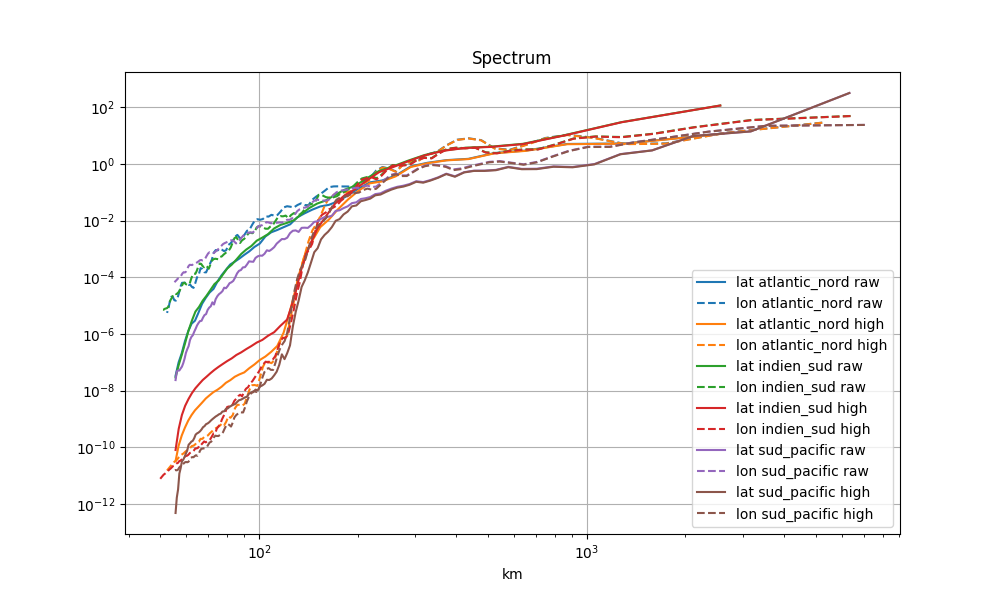

========
Spectrum
========

Compute spectrum and spectrum ratio on some area
************************************************

Load data

.. code-block:: python

    raw = RegularGridDataset(grid_name, lon_name, lat_name)
    filtered = RegularGridDataset(grid_name, lon_name, lat_name)
    filtered.bessel_low_filter('adt', 150, order=3)

    areas = dict(
        sud_pacific=dict(llcrnrlon=188, urcrnrlon=280, llcrnrlat=-64, urcrnrlat=-7),
        atlantic_nord=dict(llcrnrlon=290, urcrnrlon=340, llcrnrlat=19.5, urcrnrlat=43),
        indien_sud=dict(llcrnrlon=35, urcrnrlon=110, llcrnrlat=-49, urcrnrlat=-26),
    )

Compute and display spectrum

.. code-block:: python

    fig = plt.figure(figsize=(10,6))
    ax = fig.add_subplot(111)
    ax.set_title('Spectrum')
    ax.set_xlabel('km')
    for name_area, area in areas.items():

        lon_spec, lat_spec = raw.spectrum_lonlat('adt', area=area)
        mappable = ax.loglog(*lat_spec, label='lat %s raw' % name_area)[0]
        ax.loglog(*lon_spec, label='lon %s raw' % name_area, color=mappable.get_color(), linestyle='--')

        lon_spec, lat_spec = filtered.spectrum_lonlat('adt', area=area)
        mappable = ax.loglog(*lat_spec, label='lat %s high' % name_area)[0]
        ax.loglog(*lon_spec, label='lon %s high' % name_area, color=mappable.get_color(), linestyle='--')

    ax.set_xscale('log')
    ax.legend()
    ax.grid()
    fig.savefig('share/png/spectrum.png')

Compute and display spectrum ratio

.. code-block:: python

    fig = plt.figure(figsize=(10,6))
    ax = fig.add_subplot(111)
    ax.set_title('Spectrum ratio')
    ax.set_xlabel('km')
    for name_area, area in areas.items():
        lon_spec, lat_spec = filtered.spectrum_lonlat('adt', area=area, ref=raw)
        mappable = ax.plot(*lat_spec, label='lat %s high' % name_area)[0]
        ax.plot(*lon_spec, label='lon %s high' % name_area, color=mappable.get_color(), linestyle='--')

    ax.set_xscale('log')
    ax.legend()
    ax.grid()
    fig.savefig('share/png/spectrum_ratio.png')

.. image:: ../share/png/spectrum_ratio.png
